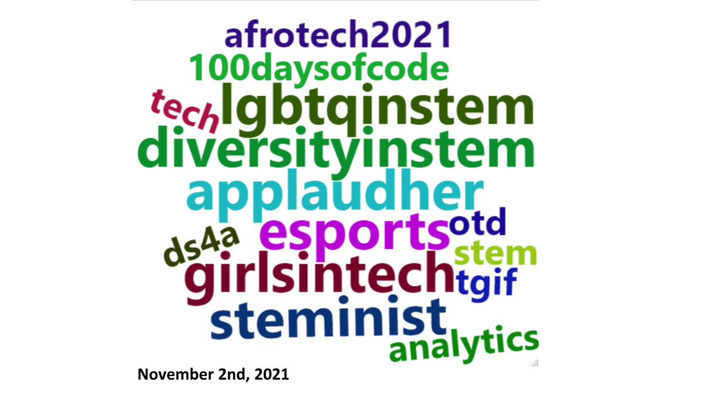

```{r setup, include=FALSE}
knitr::opts_chunk$set(echo = FALSE, warning = FALSE, fig.show = "asis", message = FALSE, error = FALSE, fig.align = "center")
library(tidyverse)
library(RColorBrewer)
library(readr)
library(lubridate)
library(forcats)
library(wordcloud2)
```

## Introduction
Techinca is the largest east coast hackathon for underrepresented genders in coding. As a first time hacker at Technica, I partnered with a friend to analyze a dataset and see what kind of story we could tell. We had 24 hours to clean the data and create graphics which tell a notable trend or story hidden in the data. Our project focuses on the trend of hashtags over hte course of the collection period and we mainly chose to represent the trend through a wordclouds.

```{r data_import, include = FALSE, cache.extra = file.info("~/Fall 2021 Semester/Techinca/tst_technica_data.csv/tst_technica_data.csv")}
#Import the dataset into R and filter out unessecary rows
raw_data <- read_csv(file = "~/Fall 2021 Semester/Techinca/tst_technica_data.csv/tst_technica_data.csv", show_col_types = FALSE) %>% select(seq(1,9))
```

```{r filter, cache = TRUE, dependson="raw_data"}
#Based upon the data dictionary filter out tweets without authors and ids
filtered <- raw_data %>% filter(!is.na(id), !is.na(author)) %>% mutate(date = ymd_hms(timestamp)) %>% filter(!is.na(date))


```

```{r, cache=TRUE, dependson="filtered"}
#Create datasets consisting of unique tweets and distinct tweets to accomodate retweets
non_unique_body <- filtered %>% filter(!is.na(body)) %>% group_by(body) %>% summarise(n = n()) %>% filter(n > 1) 

distinct_tweets <- filtered %>% distinct(body, .keep_all = TRUE)
```


## The Data

The focus of our analysis is a data set of webscraped tweets each including hashtags relating to STEM and computer science. The dataset in its raw form includes `r nrow(raw_data)` rows and `r ncol(raw_data)` columns. However, many of the rows are actually retweets. Filtering out missing data rows and duplcate values we obtain `r nrow(distinct_tweets)` rows of tweets.

## Time Period

The data is mined from twitter over the course of eleven days from November 2nd, 2021 to November 12th, 2021. We can see a steady increase in the number of tweets mined over the course of the eleven days, with the exception of November 11th. 

```{r total_tweets, cache = TRUE, dependson="filtered"}

date_summary <- filtered %>% mutate(day = date(date)) %>% group_by(day) %>% summarise(n = n())

date_summary %>% ggplot(aes(x = factor(day), n)) + geom_col() + theme(axis.text.x = element_text(angle = 45, vjust = 0.5)) + labs(title = "A peak in number of collected tweets over the collection period", x = "Day", y = "Number of Tweets")
```


If we divide each column by the overall number of sentiment scores we obtain the following graphic.

```{r sentiment bar, cache = TRUE, dependson="filtered"}
date_sent <- filtered %>% filter(!is.na(sentiment_label)) %>% group_by(date(date), sentiment_label) %>% summarise(n=n())
colnames(date_sent)[1] <- "date"

```

```{r}
date_sent %>% ggplot(aes(x= factor(date),y = n, fill = sentiment_label)) +geom_col() + theme(axis.text.x= element_text(angle = 45, vjust = 0.5)) +scale_fill_manual(values =c("#E8998D","#66A1E1","#5CAD77")) + labs(title = "Frequency of tweets over time sorted by sentiment label", x= "Date", y = "Frequency", fill= "Overall Sentiment") 

```

Note that there is an unusually small amount of tweets mined on November 11th. Zooming in further we can see there are no tweets mined from 2:00 to 23:00 on November 11th.

```{r Expanded Time Period, cache = TRUE, dependson="filtered"}

filtered %>% mutate(day = date(date), hour = hour(date)) %>% group_by(day, hour) %>% summarise(n = n())%>% ungroup() %>% complete(day, hour, fill = list(n = 0)) %>% mutate(date = make_datetime(year = year(day), month = month(day), day = day(day), hour = hour)) %>% ungroup() %>% ggplot(aes(x = date, y = n)) + geom_line() +theme(axis.text.x = element_text(angle= 45, vjust = 0.5)) + labs(title = "Frequency of Tweets over Time", x = "Date", y = "Number of Tweets")
```

Summarizing tweet length by day, we can see that the data is heavily influenced by outliers as you can see by comparing the median with the mean of each day.

```{r, cache = TRUE, dependson="filtered"}

filtered %>% mutate(length = str_length(body)) %>% filter(!is.na(length)) %>% group_by(date(date)) %>% summarise(n= n(), mean = mean(length), median = median(length), max = max(length), min = min(length)) %>%  knitr::kable(col.names = c("Date","N","Mean","Median", "Max","Min"))
```


## Authors

Each tweet is not just a single post from a single account. There were a number of bots in the dataset. Here are the top 15 posters of who tweeted the highest number of distinct tweets.
```{r authors, cache = TRUE, dependson="distinct_tweets"}
multiple_author_summary <- distinct_tweets %>% group_by(author) %>% summarise(n = n()) %>% filter(n > 1) %>% arrange(desc(n)) %>% head(15)

knitr::kable(multiple_author_summary, col.names = c("Author", "N"))

```

## Hashtag Distribution

Overall the number of hashtags is skewed heavily towards the smaller end. Here the results are separated based upon the overall result of their sentiment score.

```{r hastags, cache = TRUE, dependson="distinct_tweets"}
count_hashtags = function(x){
  if(is.na(x)){
    return(as.integer(0))
  }else{
    return(as.integer(str_count(x, pattern = ",") + 1))
  }
}

hashtags <- distinct_tweets %>% filter(!is.na(sentiment_label)) %>% mutate(num_hashtags = map_int(hashtags, count_hashtags))

hashtags %>% group_by(num_hashtags, sentiment_label) %>% summarise(n = n(), mean = mean(as.numeric(sentiment_score), na.rm = TRUE)) %>% ungroup() %>% ggplot(aes(x = factor(num_hashtags), y = n)) + geom_col() + facet_grid(~sentiment_label) + coord_flip() + labs(title = "Number of hashtags used in a tweet sorted by the overall sentiment", x = "Number of Hashtags in Tweet", y = "Frequency")
```

## Hashtags

If we breakdown the analysis of hashtags further. We can find the most often used hashtags of the time period in our dataset. Taking all hashtags recorded over the dataset, we can the top recorded hashtags.

```{r procces hashtag, cache= TRUE}
extract_hashtags <- function(x) {
    x %>% str_remove(pattern = "\\[") %>% str_remove_all(pattern = "\"") %>% str_remove(pattern = "\\]") %>% str_split(pattern = ",")%>% as.vector()
  }
process_hash <- function(data){
  hashtags <- data %>% filter(!is.na(hashtags)) %>% select(hashtags)
  hash_list <- map(hashtags$hashtags, extract_hashtags)
  hash_arr <- unlist(hash_list)
  return(hash_arr)
}

```

```{r freq hashtags, cache = TRUE}
unique_single_hash <- process_hash(filtered)

hash_table <- tibble(as.vector(unique_single_hash))
colnames(hash_table) <- "hashtag"
hash_freq <- hash_table %>% mutate(lower = str_to_lower(hashtag)) %>% group_by(lower) %>% summarise(n = n()) %>% arrange(desc(n)) %>% filter(percent_rank(n)> 0.95)

wordcloud2(hash_freq)
```

However, this is not factoring retweets which may duplicate the hashtags used. This is the word cloud factoring out retweets.
```{r, cache = TRUE, dependson = "distinct_tweets"}
unique_single_hash <- process_hash(distinct_tweets)

hash_table <- tibble(as.vector(unique_single_hash))
colnames(hash_table) <- "hashtag"
hash_freq <- hash_table %>% mutate(lower = str_to_lower(hashtag)) %>% group_by(lower) %>% summarise(n = n()) %>% arrange(desc(n)) %>% filter(percent_rank(n)> 0.95)

wordcloud2(hash_freq)
```

```{r export_hashtags, eval = FALSE}
for(i in seq(2, 12)){
  day <- filtered %>% filter(day(date) == i) %>% select(hashtags) %>% filter(!is.na(hashtags)) %>% write_csv(file = str_c("hashtags_day_", i, ".csv"))
}

```

```{r, eval = FALSE, cache = TRUE}
files <- list.files("~/Fall 2021 Semester/Techinca/rehashtagwithretweetsseparatedbydays", full.names = TRUE)
process_text <- function(x){
  string = read_file(x) %>% str_split(pattern = ",", simplify = TRUE) 

hash_table <- tibble(as.vector(unique_single_hash))
colnames(hash_table) <- "hashtag"
hash_freq <- hash_table %>% mutate(lower = str_to_lower(hashtag)) %>% group_by(lower) %>% summarise(n = n()) %>% arrange(desc(n)) %>% filter(percent_rank(n) > 0.75)
wordcloud2(hash_freq)
}


```

If we divide the data into days, we can see consistencies between hashtag popularities over the time period. We can create gifset looping over each wordcloud associates with each day.




## Further Research

If given more time, we would explore deeper into the correlation between the hashtags that appear in a tweet and the overall sentiment score of said tweet. We would try to answer the question of, is there a subset of hashtags common in many negative tweets?